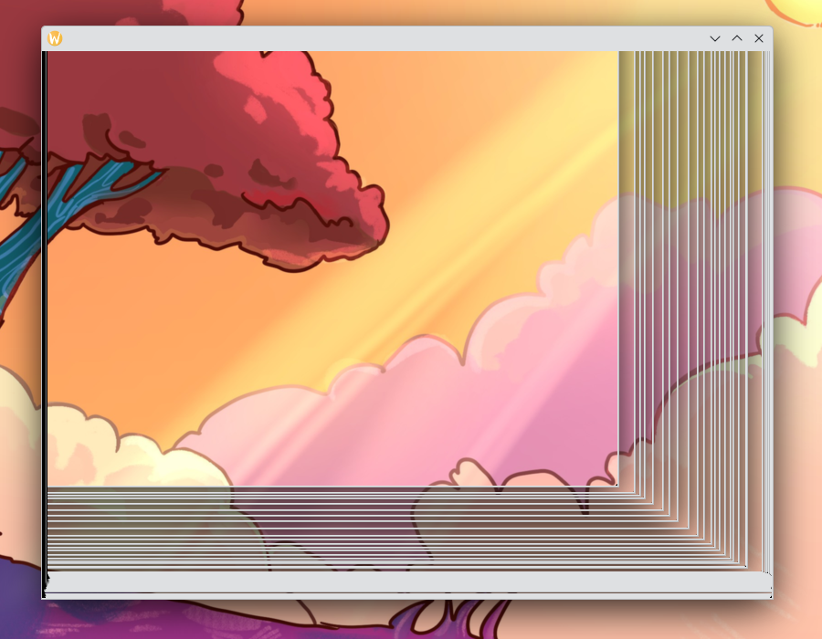

# Creating an Empty Window

In this chapter, we will start by
- setting up our project
- making it draw an empty window
- handle events such as key presses

At the end of this chapter, as in any other chapter, you will find the complete code for the chapter. So if something does not seem to work you can check there for things that might look different in your code.

## Initialising a New Rust Project

First of all create a new Rust project with a name of your liking – we'll be using `opengl_project` for this tutorial. Run:

```bash
cargo new opengl_project
```

We will use the crate `glwindow` which is a very small wrapper-crate around `glutin` and `winit`. It simplifies the usage of `winit` but thus does not offer all the flexibility (such as creating multiple windows, non-resizeable windows and the-like). If you want to have more control about creating your windows and OpenGl contexts, I recommend having a peek at [the outlook chapter of this tutorial](next.md).

Add `glwindow` to your `Crates.toml`, e.g. by running:

```bash
cargo add glwindow@=0.1.0
```

## Some Imports
Now open the Rust file `src/main.rs`. First of all we're going to need to import

```rust,no_run,noplayground
{{#include ../chapter1_empty_window/src/main.rs:1:4}}
```

## Some Structs and A Function

Next we will define two struct—for now empty: `AppState` and `AppRenderer`. Those two will be responsible for handling the state of our OpenGL app and the OpenGL rendering respectively.

```rust
{{#include ../chapter1_empty_window/src/main.rs:6:7}}
```

For `glwindow` to make sense of our `AppRenderer`, we need to implement the `Renderer` trait:

```rust
{{#include ../chapter1_empty_window/src/main.rs:9:13}}
```

We also need an event handler. Let's use an event handler that does not handle any events first:

```rust
{{#include ../chapter1_empty_window/src/main.rs:15:16}}
    Ok(EventLoopControl::Continue)
}
```

## The Main Function and Running our Code

Finally we can tie everything up in our `main` function. We will create an `AppState` and pass it to `glwindow::Window::run` together with our event handler function `handle_event`:

```rust
{{#include ../chapter1_empty_window/src/main.rs:31:35}}
```

Here, `glwindow::Window::<_,_,Renderer>::new()` creates a new window (the `::<_,_,Renderer>` lets it know about the our Render, which we'll implement in the next chapter) and the `run` method starts the event loop for our window.

Now we can run our programm:

```
cargo run
```

You should see something like this:


<div class="warning">
Don't worry that it might seem like the window can not be closed. Just press `Ctrl-C` in your terminal or stop execution of the programm in your IDE to quit the programm and thus also close the window! We'll come to that in a minute!
</div>

Maybe the window is just completely transparent and shows what's behind it or maybe when you move the window, it will start showing the solitair effect that you might know from frozen windows. It depends on whether your platform supports transparent windows:



Either way, this is because we don't draw anything in our app yet! So what was on the screen before, will still be shown inside of our window.

Well, congratulations! You've now drawn your first window! Let's make it so the user can close it, too.

## Adding Event Handling and Allowing the User to Close our Window

Now we want to handle some events! Events are created whenever the user does something with our App:
 - When the mouse is moved, an event is created.
 - When the mouse is clicked, an event is created.
 - When a key is pressed, an event is created.
 - …

You get the idea!

Most importantly for us now:
 - When the user tries to close our window, an event is created.

So this is why we can't close our window for now! When we try to close it, an event is created, but it is our responsibility to react to this event and actually close the app.

Whenever an event is created, our event handler function `handle_event` will be called with this event.

We can do what we want by checking whether the event that is passed to `handle_event` is of the value `WindowEvent::CloseRequested` and then closing our app. We can close the app by returning `Ok(AppControl::Exit)` instead of `Ok(AppControl::Continue)`.

So we can just do that! Replace the function body of `handle_event` by the following code:

```
    if let WindowEvent::CloseRequested = event {
        Ok(AppControl::Exit)
    } else {
        Ok(AppControl::Continue)
    }
```

If you run the code again, you should now be able to close the window as one would expect of a window!

## Handling Key Presses as Well

While we're at it, let's also handle key presses. As soon as we're handling more than one type of event, it makes sens to replace the `if`-`else` control flow by a `match` control flow. And since in the future we'll want to handle a lot more events and most of them will not close the app, we'll defer the decision of returning `AppControl::Continue` or `AppControl::Exit` to the end of the `handle_event` function.

A key press will register as a `WindowEvent::KeyboardInput` valued event. This value has more data, we're only interested if the `event` field has a `KeyEvent` value. An inside there we can check whether the `logical_key` field has a certain value. We can for example check if `logical_key` is of the value `Key::Named(Escape)` to check whether the event was created because the user did something with the escape-key.

Here is a definition of `handle_event` that allows the user to close the window by closing it normally or by just pressing the escape-key:

```rust
{{#include ../chapter1_empty_window/src/main.rs:15:29}}
```

## Play Around with it

Try if you can make the app close itself with another key than the escape-key. For example the user could want to press 'Q' to quit the app. For the identification of the keys you can follow [the glwindown crate documentation ](https://docs.rs/glwindow/0.1.0/glwindow/keyboard/enum.Key.html).

    E.g. for the key 'Q' you can check whether `logical_key` has the value `Key::Character("q".into())`.


## The Full Code for This Chapter


### Cargo.toml
```rust
{{#include ../chapter1_empty_window/Cargo.toml}}
```

### src/main.rs
```rust
{{#include ../chapter1_empty_window/src/main.rs}}
```
