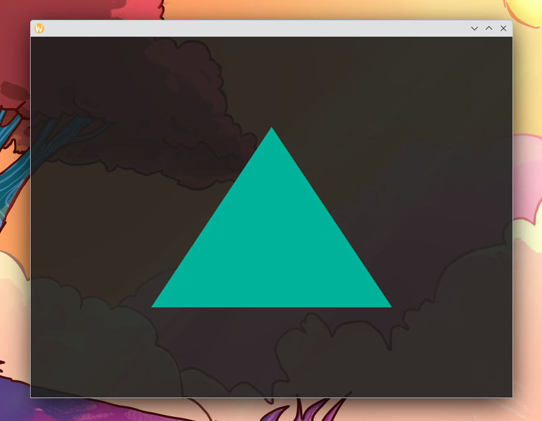

# Drawing a Simple Triangle

In this chapter will will draw our first triangle onto the screen!

### Extending the Render State

Our Renderer struct will need to know about three new properties:

- An OpenGL **program**: This is the set of shaders that we will want to execute on our hardware.

  The first one, the **vertex shader**, will calculate the on-screen coordinates of our triangle.
  Thus it will output a coordinate for each point of our triangle that we put in.

  The second one, the **fragment shader** (also known as **pixel shader**), will calculate the color of each pixel of the resulting on-screen triangle.
  Since we are starting with a simple single-color triangle, our fragment shader will just output a constant colour.

- An OpenGL **Vertex Array Object (VAO)**:
  This will store informations on all vertex buffers we are using and their meaning.

  In our case this will contain only our single VBO, together with the information that our vertex buffer contains
  3 sets of data (one for each point of the triangle) that each will be bound to the `position` variable of our OpenGL program and is consisting of three floats each.

- And finally an OpenGL **Vertex Buffer Object (VBO)**:
  This will just store the positions of our vertices – i.e. the three points of our triangle.

Each of these three properties will just be an integer (`GLUint`) that is meant for OpenGL to identify the corresponding internal object:

```rust
{{#include ../chapter3_triangle/src/main.rs:14:19}}
```

### Our Vertex Buffer

This will be very easy, we just define a simple static array of all our vertex coordinates for our triangle.

This will just be a single array consisting of \\([x_1, y_1, z_1, x_2, y_2, z_2, …]\\). So \\((x_1, y_1, z_1)\\) will describe the \\(x\\)-, \\(y\\)- and \\(z\\)-coordinate of our first point, respectively, \\((x_2, y_2, z_2)\\) will describe the \\(x\\)-, \\(y\\)- and \\(z\\)-coordinate of our second point, respectively, and so on. And since we want to describe a triangle, _“and so on”_ only means _one more point_.

```rust
{{#include ../chapter3_triangle/src/main.rs:21:26}}
```

[Add graphic of coordinate system here]

### Here Come the Shaders

This one of the cornerstones of our OpenGL tutorial: The shaders!

As mentioned above, we will need two shaders:

- A **vertex shader**. The vertex shader will calculate the on-screen coordinates of our triangle.
  It get a vertex coordinate from our vertex buffer as an input (which we will later tell OpenGL we want to name `position`) and outputs the on-srceen coordinates in by setting the output `gl_Position`.
  We already set the vertex buffer to contain the on-screen coordinates, so we will just output the same coordinate as as 4-dimensional vector. For now you can just ignore the fourth coordinate. Just remember that it always needs to be set to 1.0, for everything to look normal. (You can play around with a few values close to 1.0 and will see that it acts like an inverse scale factor. That is actually exactly what it does, but we will come to the reasoning for that later on!)

- A **fragment shader**. The fragment shader will calculate the color of each pixel of the resulting on-screen triangle.
  Since we are starting with a simple single-color triangle, our fragment shader will just output a constant colour.
  The color is given as a 4-dimensional vector describing a point in the RGBA-space. So the first coordinate sets a _red_-value between 0.0 and 1.0, the second _green_, the third _blue_, and finally the fourth value gives an _alpha_-value, also called “opacity”–this describes how non-transparent the colour is on a scale from 0.0 (completeley transparent) to 1.0 (completely opaque).

I choose a nice orange, here, with no red, 0.7 green, 0.6 fifth of blue and full opacity \\((r=0.0, g=0.6, b=0.7, a=1.0)\\).
Thus our shaders look like this:

```rust
{{#include ../chapter3_triangle/src/main.rs:28:46}}
```
The shaders need to be given to OpenGL as null-terminated strings (though we could also pass them as a string with length). For this we need to import `CStr` from `std::ffi` (or use `std::ffi::CStr` directly):
```rust
use std::ffi::CStr;
```

As you can see, the shaders are their own small program written in a dialect of C (called OpenGL Shading Language or short GLSL). The first line sets the version of GLSL we want to use–in our case we're using 4.1: `#version 330 core`.

Next we can define input (`in`) and output (`out`) parameters.

For our vertex shader that is the position that we get from our vertex buffer as input: `in vec4 position`. The output is an [OpenGL built-in output variable](https://www.khronos.org/opengl/wiki/Built-in_Variable_(GLSL)) `vec4 gl_Position`.

Our fragment shader gets no input as we just want to draw a single colour, but we have to define our output variable which outputs this colour: `out vec4 color`. (Note that on some platforms you don't have to define the output variable, since there's a built-in called `gl_FragColor`. But since it's not working on all platforms, we will just define our own output!)

### Compiling and Loading our Shaders

Now we have to compile and load our shaders and tell OpenGL about our vertex buffers. All of this happens in `Renderer::new`.

#### Compiling the Shaders

in `Renderer::new`, right after the call to `gl::Gl::load_with`, we will create our shaders using, `gl.CreateShader`, `gl.ShaderSource` and `gl.CompileShader`:

```rust
{{#include ../chapter3_triangle/src/main.rs:58:64}}
```

Now we can combine both shaders into what OpenGL calls a "program". Afterwards we can delete the shaders again, as their compilation product will live on in the programm.

```rust
{{#include ../chapter3_triangle/src/main.rs:66:76}}
```

Now what's left to do is to create our Vertex Array Object (VAO) and our Vertex Buffer Object (VBO).

First the VAO. Not much to do here:

```rust
{{#include ../chapter3_triangle/src/main.rs:78:80}}
```

Because we have bound the VAO using `gl.BindVertexArray(vao)`, the VBO we will create now will live on our VAO:

```rust
{{#include ../chapter3_triangle/src/main.rs:82:90}}
```

And finally we have to tell our program what input variables should come from which part of our buffer:

```rust
{{#include ../chapter3_triangle/src/main.rs:92:101}}
```


Finally, we need to modify the return value to contain our program, VAO and VBO.

```rust
{{#include ../chapter3_triangle/src/main.rs:103}}
```


### New code in Renderer::draw

```rust
{{#include ../chapter3_triangle/src/main.rs:107:118}}
```

### Cleanup of OpenGL Objects

Last but not least, there is some cleanup to do. We do not really *have* to do it, but we don't want our programm to leak any memory and OpenGL objects, especially when it becomes bigger and we might create more than one OpenGL programm.

For this, we implement the `Drop` trait for `Renderer` so the cleanup gets done automatically when our renderer is dropped by `glwindow`, either because of the program exit or because we it needed to recreate the OpenGL context.

```rust
{{#include ../chapter3_triangle/src/main.rs:126:135}}
```

### Run the Code

Let the code run, and if everything works it should look like this:



## Play Around With It

Change the colour of the triangle and the background to your liking.

If your platform supports transparency, play around with different opacity values for both the background and the triangle! What happens, when you set the background completely opaque, but the triangle to transparent or semi-transparent?

Try what happens when you move one of the triangle vertices in the z-direction? (E.g. \\(z=2.0\\))

## Full code

As always, here comes the full code of everything we've done in all the chapters before and this chapter (though some things might just reference previous chapters):

### Cargo.toml

Unchanged from [Chapter 2's Cargo.toml](chapter_2.html#cargotoml).

### build.rs

Unchanged from [Chapter 2's build.rs](chapter_2.html#buildrs).

### src/main.rs
```rust
{{#include ../chapter3_triangle/src/main.rs}}
```
