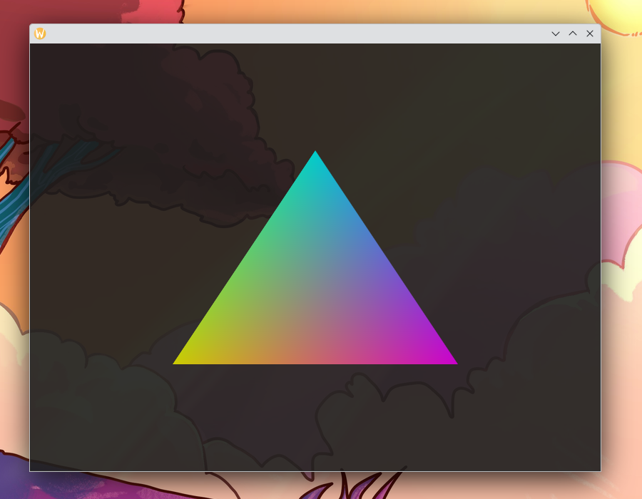
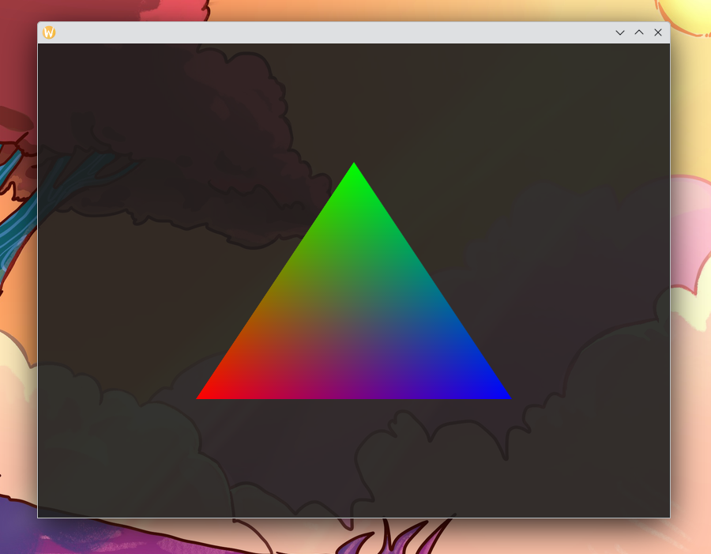

# Drawing a Triangle with Colours

### Vertex buffer
\\([x_1, y_1, z_1, r_1, g_1, b_1, …]\\)

with \\((r_1, g_1, b_1)\\) describing the colour of the the first vertex as an RGB value and so on.

```rust
{{#include ../chapter4_coloured_triangle/src/main.rs:21:25}}
```

### Vertex Shader
```rust
{{#include ../chapter4_coloured_triangle/src/main.rs:27:39}}
```

### Fragment shader
```rust
{{#include ../chapter4_coloured_triangle/src/main.rs:41:51}}
```

### Shader attributes
```rust
{{#include ../chapter4_coloured_triangle/src/main.rs:97:119}}
```



## Play Around With It

Try to make a classical RGB triangle where one vertex is just fully red, one vertex is just fully green and one vertex is just fully blue:



Since the \\(z\\)-data of all our vertexes is 0 all the time anyway, you can try to see if you can just drop it from the vertex buffer and instead set it to zero in the fragment shader. You will need to modify both calls to `gl.VertexAttribPointer` at five locations in the code in addition to the changed vertex buffer `VERTEX_DATA` and the changed fragment shader.

## Full code

As always, here comes the full code of everything we've done in all the chapters before and this chapter (though some things might just reference previous chapters):

### Cargo.toml

Unchanged from [Chapter 2's Cargo.toml](chapter_2.html#cargotoml).

### build.rs

Unchanged from [Chapter 2's build.rs](chapter_2.html#buildrs).

### src/main.rs
```rust
{{#include ../chapter4_coloured_triangle/src/main.rs}}
```
