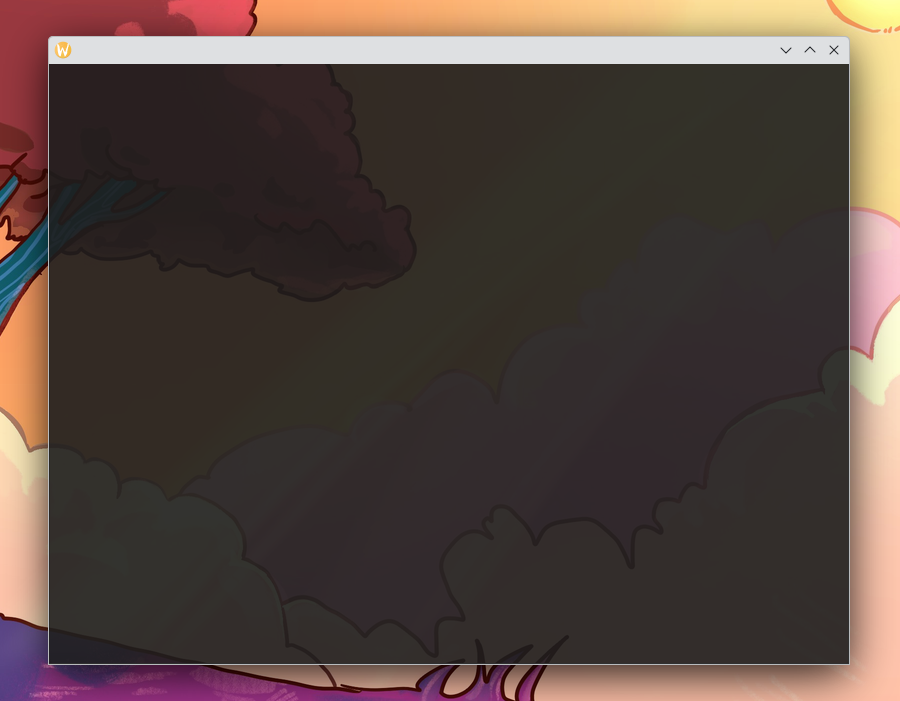
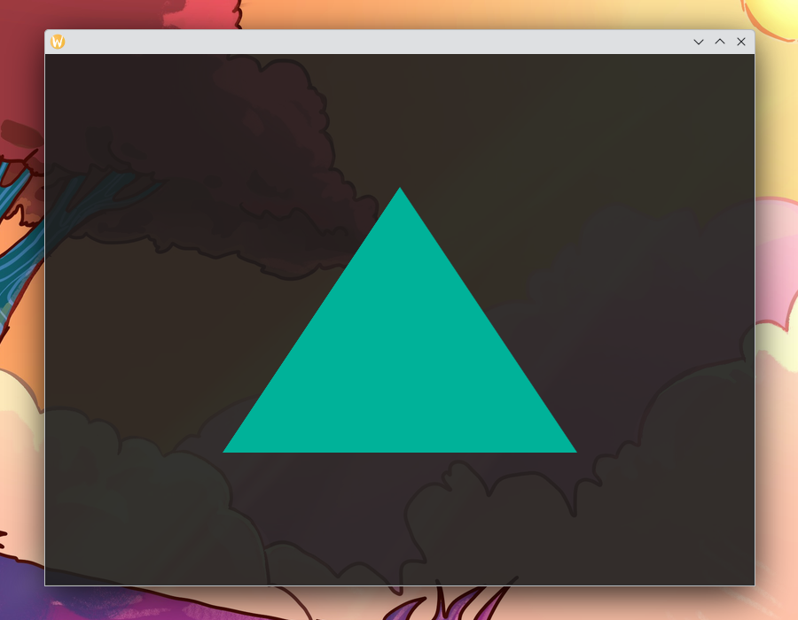

# Learn OpenGL with Rust

An OpenGL tutorial with lots of basic OpenGL and lots of unsafe rust code.

## Jump Straight In

[<video style="width: 40%; margin: 0.5em 3%;" autoplay loop muted><source src="rotating_triangle.mp4" type="video/mp4" /></video>](chapter_5.md)
[<video style="width: 40%; margin: 0.5em 3%;" autoplay loop muted><source src="rotating_triangle_3d.mp4" type="video/mp4" /></video>](chapter_6.md)
